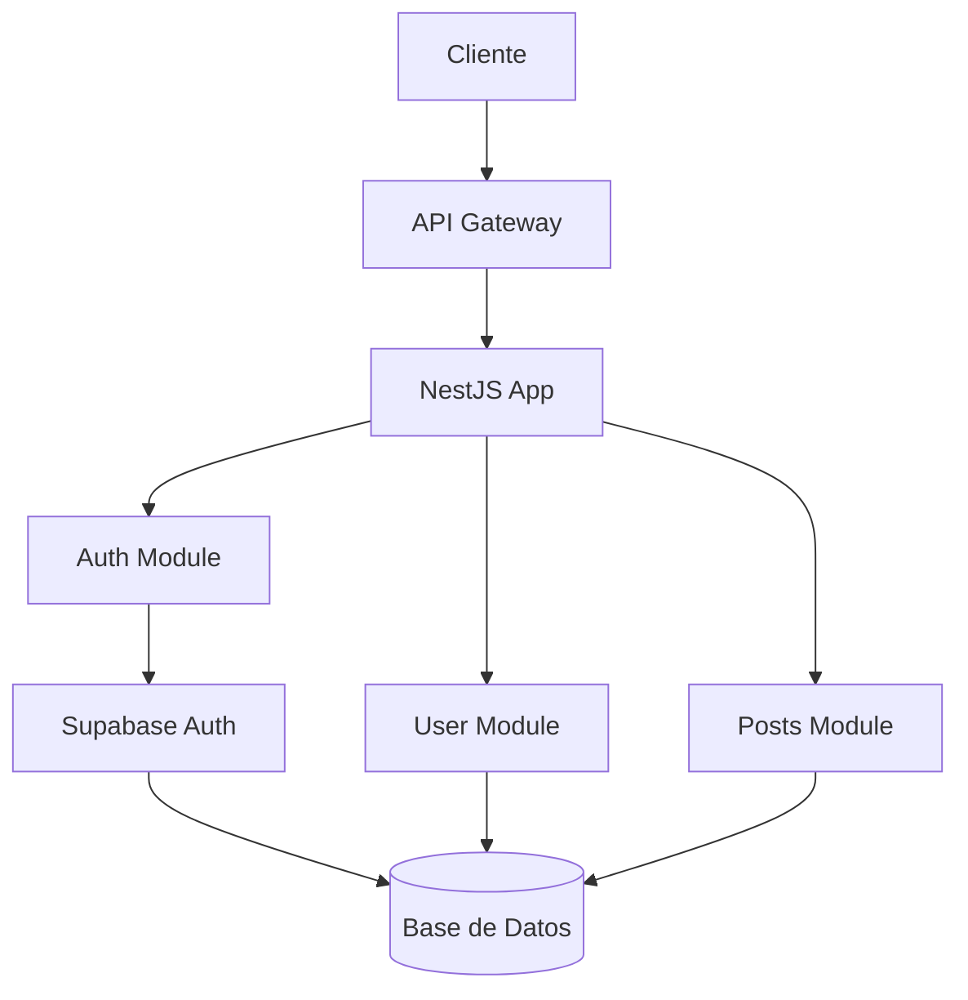
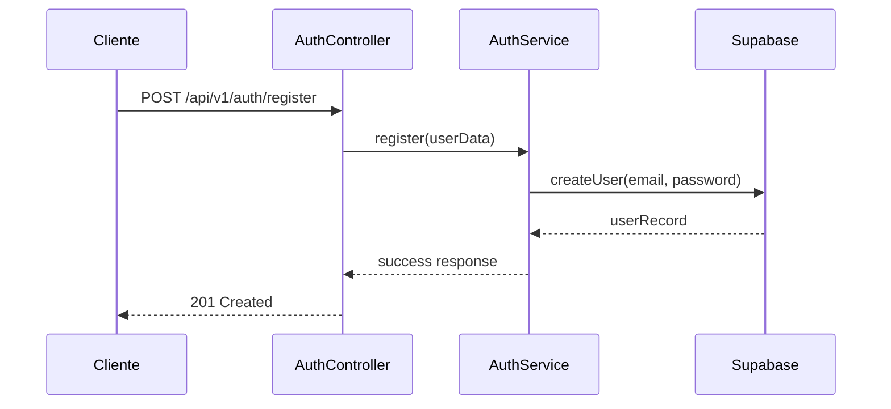

# 🚀 Social Network WebApp - Backend API

## Bienvenido/a al repositorio del proyecto **Social Network** - Backend API

Este proyecto es una API RESTful construida con **NestJS**, **TypeScript** y **Supabase** que proporciona servicios de autenticación y gestión de usuarios para la aplicación de red social.

---

[](LICENSE)
[](https://nestjs.com/)
[](https://www.typescriptlang.org/)
[](https://supabase.com/)

API RESTful moderna construida con **NestJS**, **TypeScript** y **Supabase**.
Proporciona servicios de autenticación, gestión de usuarios y base para funcionalidades sociales.

---

## 🔹 **Funcionalidades clave**

- 🔐 **Autenticación robusta** con Supabase (registro, login, JWT)
- 👤 **Gestión de usuarios** con perfiles y datos seguros
- 🛡️ **Guards y middleware** para protección de rutas
- 🔒 **Validación de datos** con class-validator
- 📝 **DTOs tipados** para requests y responses
- 🧪 **Testing completo** con Jest y Supertest

---

## 🏗️ **Arquitectura**



### Flujo de Autenticación



---

## 🤝 Contribución

Para conocer las pautas detalladas de contribución, consulta el archivo [CONTRIBUTING.md](CONTRIBUTING.md).

---

## 🖥️ **Configuración y Uso**

### **Requisitos Previos**

- Node.js >= 18.x
- npm >= 9.x (o pnpm/yarn)
- Una cuenta de Supabase con proyecto configurado

### **Instalación**

1. **Clona el repositorio**:

```bash
git clone https://github.com/CodeCrafters-ES/social-network-webapp-backend.git
cd social-network-webapp-backend
```

2. **Instala dependencias**:

```bash
npm install
```

3. **Configura las variables de entorno**:

Crea un archivo `.env` en la raíz del proyecto:

```env
# Supabase Configuration
SUPABASE_URL=tu_supabase_url
SUPABASE_ANON_KEY=tu_supabase_anon_key
SUPABASE_SERVICE_ROLE_KEY=tu_service_role_key

# JWT Configuration
JWT_SECRET=tu_jwt_secret

# Application
PORT=3000
NODE_ENV=development
```

4. **Inicia el servidor de desarrollo**:

```bash
# Desarrollo con auto-reload
npm run start:dev

# Producción
npm run start:prod
```

La API estará disponible en `http://localhost:3000`

### **Endpoints principales**

| Método | Endpoint | Descripción |
|--------|----------|-------------|
| POST | `/api/v1/auth/register` | Registro de nuevos usuarios |
| POST | `/api/v1/auth/login` | Inicio de sesión |
| POST | `/api/v1/auth/refresh` | Renovar sesión con refresh token |
| POST | `/api/v1/auth/logout` | Cerrar sesión e invalidar refresh token |
| GET | `/auth/profile` | Obtener perfil del usuario |

---

## 🧪 **Testing**

```bash
# Ejecutar todos los tests
npm run test

# Testing con coverage
npm run test:cov

# Testing en modo watch
npm run test:watch

# E2E Testing
npm run test:e2e
```

---

## 📁 **Estructura del Proyecto**

```
social-network-webapp-backend/
├── src/
│   ├── auth/                 # Módulo de autenticación
│   │   ├── dto/             # Data Transfer Objects
│   │   ├── guards/          # Guards para protección de rutas
│   │   ├── auth.controller.ts
│   │   ├── auth.service.ts
│   │   └── auth.module.ts
│   ├── config/              # Configuración de servicios externos
│   │   └── supabase.config.ts
│   ├── common/              # Utilidades compartidas
│   ├── modules/             # Módulos de la aplicación
│   │   ├── users/           # Gestión de usuarios
│   │   ├── posts/           # Publicaciones
│   │   └── notifications/   # Notificaciones
│   ├── app.controller.ts
│   ├── app.module.ts
│   └── main.ts             # Punto de entrada
├── test/                   # Tests end-to-end
├── .env                    # Variables de entorno
├── package.json
├── tsconfig.json
└── README.md
```

---

## 🚀 **Scripts Disponibles**

| Script | Descripción |
|--------|-------------|
| `npm run start:dev` | Servidor de desarrollo con auto-reload |
| `npm run start:prod` | Build y ejecución en producción |
| `npm run build` | Compilar la aplicación |
| `npm run test` | Ejecutar tests unitarios |
| `npm run test:e2e` | Ejecutar tests end-to-end |
| `npm run lint` | Ejecutar linter |
| `npm run format` | Formatear código con Prettier |

---

## 🔧 **Tecnologías Utilizadas**

- **Framework**: NestJS
- **Lenguaje**: TypeScript
- **Base de datos**: Supabase (PostgreSQL)
- **Autenticación**: Supabase Auth + JWT
- **Validación**: class-validator + class-transformer
- **Testing**: Jest + Supertest
- **Linter**: ESLint
- **Formateo**: Prettier

---

## 📚 **Documentación Adicional**

- [Documentación de NestJS](https://docs.nestjs.com/)
- [Guía de Supabase](https://supabase.com/docs)
- [TypeScript Handbook](https://www.typescriptlang.org/docs/)

---

## 🆘 **Soporte**

¿Problemas con la configuración?

1. Verifica que todas las variables de entorno estén configuradas correctamente
2. Asegúrate de que tu proyecto de Supabase esté activo
3. Revisa los logs del servidor para errores específicos
4. Consulta la documentación oficial de las tecnologías utilizadas

---

## 📜 **Licencia**

Este proyecto es de código abierto bajo licencia [MIT](LICENSE).

© 2025 CodeCrafters - ES

---

## 🔄 **Estado del Proyecto**

🏗️ **En Desarrollo Activo** - Estamos trabajando en nuevas funcionalidades y mejoras continuas.
